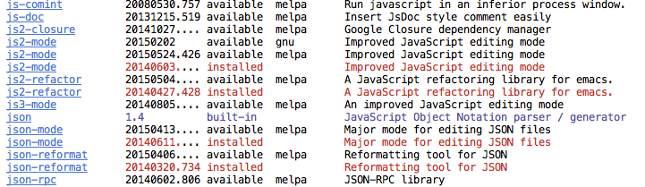
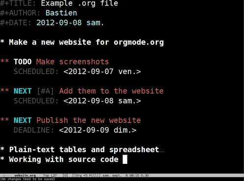
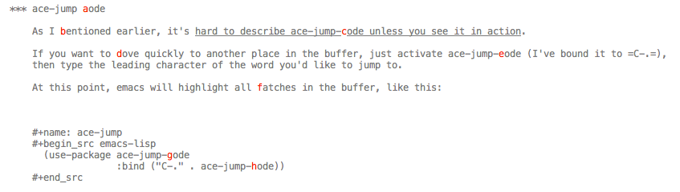
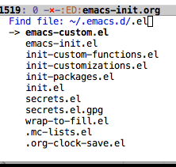
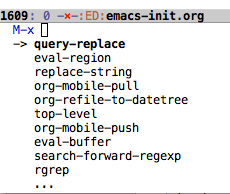
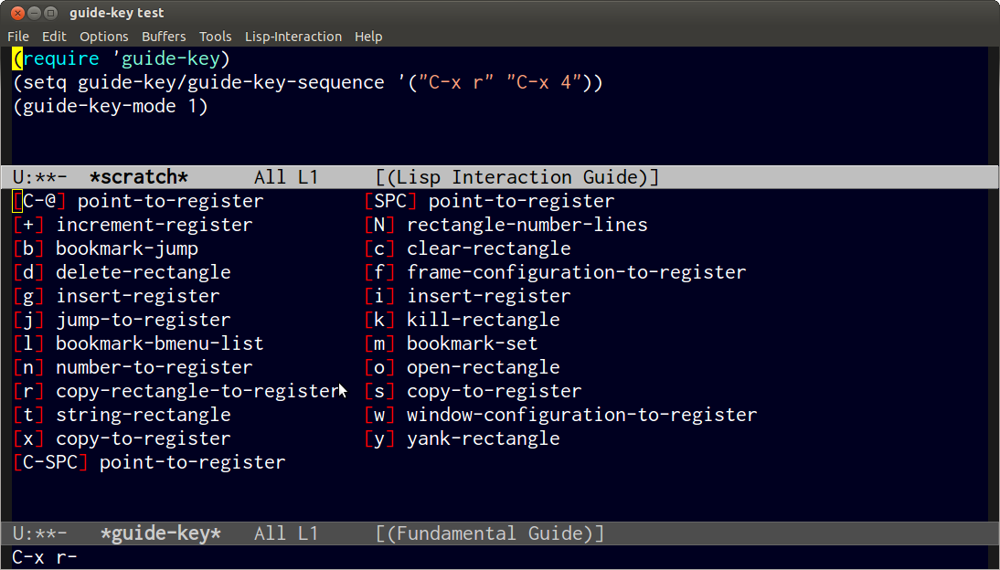
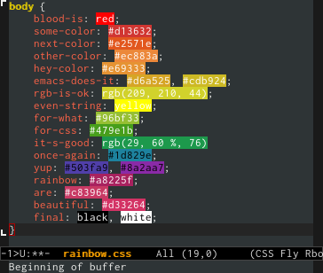

#+TITLE: Jeff's Emacs config
#+AUTHOR: Jeff Stautz
#+EMAIL: jeff@jeffstautz.com
#+LANGUAGE:  en
#+OPTIONS: toc:nil num:2 ^:nil H:4
#+PROPERTY: tangle emacs-init.el

#+begin_quote
People talk about getting used to a new editor, but over time, it is precisely the opposite that should happen --- the editor should get used to us.

--- [[http://blog.vivekhaldar.com/post/31970017734/new-frontiers-in-text-editing][Vivek Hadlar]]
#+end_quote

#+TOC: headlines 2

* Introduction
:PROPERTIES:
:CUSTOM_ID: introduction
:END:

** What is this?
:PROPERTIES:
:CUSTOM_ID: what_is_this
:END:

It's a [[http://en.wikipedia.org/wiki/Literate_programming][literate programming]] version of my Emacs config files.

My current setup borrows liberally from Emacs users far smarter than I am, including:
- [[http://doc.norang.ca/org-mode.html][Bernt Hansen]] 
- [[https://github.com/eschulte/emacs24-starter-kit][Eric Schulte]]
- [[https://github.com/magnars/.emacs.d][Magnar Sveen]]
- [[http://dl.dropboxusercontent.com/u/3968124/sacha-emacs.html][Sacha Chua]]
- [[https://github.com/technomancy/dotfiles][Phil Hagelberg]]
- [[https://github.com/bodil/emacs.d][Bodil Stokke]]
- [[http://www.masteringemacs.org/][Mickey Petersen]]
- And a ton of others. 

Props and praises are scattered throughout my config in places where I can remember who I stole something from.

** What's literate programming?
:PROPERTIES:
:CUSTOM_ID: what_is_literate
:END: 

Short answer: instead of writing separate documentation, the documentation /contains/ the program. The code itself is secondary to the explanation about how it works.

Or as Knuth puts it:

#+begin_quote 
Instead of imagining that our main task is to instruct a computer what to do, let us concentrate rather on /explaining to humans/ what we want the computer to do.

--- Donald E. Knuth, Literate Programming, 1984
#+end_quote

The document you're reading now is an [[http://org-mode.org][org-mode]] text file that contains both code *and* documentation. 

On startup, emacs pulls out ("tangles") the code snippets in this file and uses them to configure the editor.

** Why use literate programming for my Emacs config?
:PROPERTIES:
:CUSTOM_ID: why_literate
:END:

It's an experiment. We'll see how well it works out.

I've been inspired by [[http://dl.dropboxusercontent.com/u/3968124/sacha-emacs.html][Sacha Chua's literate emacs config]], as well as by [[http://doc.norang.ca/org-mode.html][Bernt Hansen's amazingly thorough and detailed documentation of his org-mode setup]].

Using a literate programming approach has a number of advantages that appeal to me:

1. *Better organization of my .emacs lisp files*
   - My elisp code snippets are embedded within the fold-able goodness of org-mode's outline structure.
   - My configuration is better organized and easier to understand.

2. *I'm better able to follow my own thought processes.*
   - Explanations take priority, code is secondary.
   - When I revisit code I wrote ten years ago, I have a hope of understanding /what the hell I was thinking./

3. *Sharing my setup is easier*
   - I have one file that generates nice-looking documentation and the code itself.
   - Detailed explanations of my setup mean it's easier for others to understand it and benefit from it.

** Disclaimers and Warnings
:PROPERTIES:
:CUSTOM_ID: disclaimer
:END:

Fair warning:

- This is a perpetual work in progress. 
- No attempts have been made to make this setup portable. It's full of weird environment idiosyncracies, and there are probably a bunch of undocumented dependencies.
- Requires Emacs 24.3+. Only tested on Mac OS X.
- I'm not responsible if any of this blows up on you.

** License
:PROPERTIES:
:CUSTOM_ID: license
:END:

#+begin_example
Copyright (C)  2014  Jeff Stautz

Permission is granted to copy, distribute and/or modify this document under the
terms of the GNU Free Documentation License, Version 1.3 or any later version
published by the Free Software Foundation; with no Invariant Sections, no
Front-Cover Texts, and no Back-Cover Texts.
  
Code in this document is free software: you can redistribute it and/or modify it
under the terms of the GNU General Public License as published by the Free
Software Foundation, either version 3 of the License, or (at your option) any
later version.
  
This code is distributed in the hope that it will be useful, but WITHOUT ANY
WARRANTY; without even the implied warranty of MERCHANTABILITY or FITNESS FOR A
PARTICULAR PURPOSE. See the GNU General Public License for more details.
#+end_example 

This document (including HTML format or raw org-mode format) is licensed under the GNU Free Documentation License version 1.3 or later (http://www.gnu.org/copyleft/fdl.html).

The code examples and CSS stylesheets are licensed under the GNU General Public License v3 or later (http://www.gnu.org/licenses/gpl.html).

* Installation
:PROPERTIES:
:CUSTOM_ID: installation
:END:

It's probably best if you *don't try to install this* as a drop-in replacement for your current config. 

You're better off using this document as inspiration, cherrying picking useful bits and pieces for yourself while discarding the sections that you don't need. 

The installation instructions that follow are mostly notes for my future self. Follow them at your own peril.

** Clone this repo into your .emacs.d/ 
:PROPERTIES:
:CUSTOM_ID: clone_repo
:END:

You probably want to back up your current config before you clobber it with this one.

Once you've backed things up, clone the repo like so:

#+begin_example
$> git clone https://github.com/jstautz/.emacs.d ~/.emacs.d
#+end_example

** Now run the install.sh script 
:PROPERTIES:
:CUSTOM_ID: install.sh
:END:

Special thanks to [[http://www.swaroopch.com/2013/10/17/emacs-configuration-tutorial/][Swaroop C H]] for this script.

#+begin_example
$> cd ~/.emacs.d/
$> ./install.sh
#+end_example

install.sh will:
- Install [[http://cask.github.io/][Cask]] if you don't already have it installed
- Add the ~/.cask directory to your $PATH
  - Note: assumes you're using bash. If you're using another shell, you may need to edit install.sh before running
- Runs =cask install= to install packages listed in my Cask file, along with any dependencies

=cask install= will hit various remote Emacs package repositories (ELPA, MELPA, Marmalade, and Org) and download packages for you. Magic!

** Update paths and directories

There are several path variables in the config that [[Set a few variables for directories][you'll want to change to match your .emacs directory's structure.]] 

After you change those, you'll need to scour the config for any other hard-coded paths and change them before you even try to use it. I'm trying to consolidate these paths in one configurable place, but that's not always easy. Maybe in v2.

** Fire up Emacs
:PROPERTIES:
:CUSTOM_ID: start_emacs
:END:

Packages installed via Cask should be in your load path, and you should be ready to rock. 

If you're *not* ready to rock at this point... sorry. Don't say I didn't [[emacs-init.org#14-disclaimers-and-warnings][warn you]].

* Structure --- how this works 
:PROPERTIES:
:CUSTOM_ID: structure
:END:

Before we get too deep into my settings, I should explain a little about how all this works.

** init.el
:PROPERTIES:
:CUSTOM_ID: init.el
:END:

The init.el file is [[http://www.gnu.org/software/emacs/manual/html_node/emacs/Init-File.html][the first file that Emacs loads on startup]]. My init.el bootstraps the rest of my config by loading it via org-babel.

My init.el currently looks like this:

#+begin_src emacs-lisp :tangle no
;; Assume current directory is the dot-emacs directory and add to load-path
(setq dotemacs-dir (file-name-directory (or load-file-name (buffer-file-name))))

;; Load cask and activate it.
;; https://github.com/cask/cask
(require 'cask "~/.cask/cask.el")
(cask-initialize)

;; If emacs-init.el is *newer* than emacs-init.org, then load the *.el file directly.
;; Otherwise, tangle the *.org file and load my config.
(if (> (string-to-int (shell-command-to-string "stat -f \"%m\" ~/.emacs.d/emacs-init.el"))
       (string-to-int (shell-command-to-string "stat -f \"%m\" ~/.emacs.d/emacs-init.org")))
      (load-file (expand-file-name "emacs-init.el" dotemacs-dir))
    (org-babel-load-file (expand-file-name "emacs-init.org" dotemacs-dir)))

#+end_src

That's it.

Ignore the bits about Cask for now --- we'll get to that later. The important part is that last s-expression: 

#+begin_src emacs-lisp :tangle no
(org-babel-load-file (expand-file-name "emacs-init.org" dotemacs-dir)
#+end_src

This line calls org-babel to extract ("tangle") the code blocks from the =emacs-init.org= file into a file called =emacs-init.el=. It then tells Emacs to load all the configurations in that .el file.

[[http://orgmode.org/worg/org-contrib/babel/][Org-babel is Merlin-level wizardry.]] Eric Schulte, Dan Davison, and everyone who's worked on it all deserve medals. 

Because tangling and loading my .org file takes a few seconds (there are a lot of code blocks to deal with), I've wrapped this call to org-babel in an =if= statement that checks to see if tangling is even necessary, or if I can load the .el file directly. 

** emacs-init.org
:PROPERTIES:
:CUSTOM_ID: emacs-init.org
:END:

The =emacs-init.org= file is the meat of my emacs config. It's also the document you're reading right now.

When this document is tangled and loaded by org-babel, =emacs-init.el= is updated with the latest elisp extracted from code blocks in this file.

I try to treat the resulting =emacs-init.el= file like /compiled code/. It's the machine-readable file that I never really look at. Except maybe when debugging.

Any edits or changes, even if they're experimental, are made in the .org file instead of directly in the .el file. This way, I'm ensuring my documentation always stays up to date.

** Loading packages 
:PROPERTIES:
:CUSTOM_ID: packages
:END:

Emacs is crazy customizable, and a lot of these customizations are organized into packages.

Back in the dark ages, I would find third-party elisp packages on the interwebs and install them manually. This got nasty pretty quickly.

    - My emacs repo got bloated and disorganized
    - I could never rememember where I grabbed packages from
    - Updating packages was a chore

Emacs 24 introduced a really nice package management system, =package.el=. I used it for a while on its own, then supplemented it with [[http://cask.github.io/][Cask]], [[https://github.com/rdallasgray/pallet][Pallet]], and [[https://github.com/jwiegley/use-package][use-package]].

*** package.el
:PROPERTIES:
:CUSTOM_ID: package.el
:END:

The default package manager in Emacs 24 is super handy. Use =M-x package-list-packages= to browse packages on all source repos, then install/uninstall/update them from within Emacs. Slick! 

Here's what it looks like:

Beautiful.

Before using the package manager, I want to add a few other sources (notably [[http://marmalade-repo.org/][marmalade]] and [[http://melpa.milkbox.net/#/][melpa]]) to my package source list.
  
#+name: packages-set-sources
#+begin_src emacs-lisp
(require 'package)
(dolist (source '( ("gnu" . "http://elpa.gnu.org/packages/")
                   ("elpa" . "http://tromey.com/elpa/")
                   ("marmalade" . "http://marmalade-repo.org/packages/")
                   ("melpa" . "http://melpa.milkbox.net/packages/")))
  (add-to-list 'package-archives source t))
(package-initialize)
#+end_src

Now we're ready to install packages!

But wait... 

I don't really want my .emacs.d repo to get bloated with third party libraries. I don't want to clutter my config's changelogs whenever I update an external package. 

Git submodules are an option. But what I really want is for my .emacs setup to contain only *my* configuration, and for any public packages to be downloaded from the interwebs on-demand. And I want a really nice, clean, easy-to-understand method for doing all this. So...
 
*** Cask
:PROPERTIES:
:CUSTOM_ID: cask
:END:

Cask is a [[http://cask.readthedocs.org/en/latest/][dependency manager and much more.]]

The =Cask= file in my .emacs.d/ lists all the packages that my setup depends on, as well as specifying some source repositories (the same ones I specify for package.el, above).

Even though I don't keep *any* of my packages under version control, Cask lets me download + load all the packages I need whenever I install my Emacs config from scratch.

#+name: package-cask :tangle no
#+begin_src emacs-lisp 

(require 'cask "~/.cask/cask.el")
(cask-initialize)
#+end_src

As mentioned in the [[Installation]] section above, a simple =cask install= in my .emacs.d directory will download all required packages and dependencies.

*** Pallet
:PROPERTIES:
:CUSTOM_ID: pallet
:END:

So =package.el= lets me browse and install packages from within Emacs... and Cask manages packages outside Emacs based on a Cask file... so how am I supposed to keep these in sync?

Enter [[https://github.com/rdallasgray/pallet][Pallet]].

#+name: package-use-package
#+begin_src emacs-lisp 
(require 'pallet)
#+end_src

If I install a new package via =M-x list-packages=, Pallet automatically updates my Cask file and keeps everything working together. This way I don't lose track of anything installed via package.el --- it's all still in my config and can be pulled down via =cask install=. 

Note that the reverse is also true. If I remove a package using the built-in package manager, Pallet removes its line from my Cask file.

*** TODO update Cask and Pallet

/As I'm working on this documentation, I just noticed that Pallet and Cask now support pinning specific version numbers or git branches. This is something I want to try at some point, and should really update these packages sometime soon./
 
*** use-package
:PROPERTIES:
:CUSTOM_ID: use-packages
:END:
 
Now that I've got a way to easily install, manage, and update external packages, *and* I've got a way to seamlessly track these packages in my config... I need to declare and configure these packages.

Normally in an Emacs config, you'll see a lot of =(require 'package-name)= expressions, much like I've done with Cask and Pallet packages above. These =require= statements will find the package in the list of =load-path= directories and actually load/initialize all of the package's elisp.

This can be slow. I don't always want to load *every* single package at startup time. I'd rather load only the essentials and lazy-load (autoload) the rest when I need them.

John Wiegley's =use-package= provides some really nice macros for autoloading and configuring packages. It handles a lot of things for me out of the box, including:

- Handling missing packages without choking
- Initializing and autoloading packages
- Nicely isolating package-specific configs
- Setting keybindings in a very readable way
- Deferring configuration elisp until after a package actually gets used
- And more!

#+name: package-use-package
#+begin_src emacs-lisp 

(require 'use-package)
#+end_src

You'll see =use-package= and its syntax all over the place in my setup.

* How I Use Emacs
:PROPERTIES:
:CUSTOM_ID: how-i-use-emacs
:END:

#+begin_quote
This is my rifle. There are many like it, but this one is mine.

--- Major General William H. Rupertus, "The Rifleman's Creed," 1942
#+end_quote

Okay. You've got a pretty good picture of how my config is structured, how it's loaded via org-babel, and how packages are loaded with Cask, Pallet, and use-package. 

Before we get into the actual configuration, it might help to understand some things I do in Emacs.

My use of Emacs is by no means typical, and my configuration reflects this fact.

** Org-mode

I spend 90% of my time in Emacs inside [[http://orgmode.org/][org-mode]]. 

I've been using it for several years for taking notes, planning, writing, and tracking my to-do lists. It's a brilliant piece of software that's totally changed how I organize my digital life. 

I've got a [[Org-mode][whole section of my Emacs config dedicated to the ins and outs of my org-mode configuration.]] It's gnarly. It's complicated. It involves a lot of yak-shaving. It's ripe for refactoring. But it /works/ for me. 

** Writing

For the last 10 years, I've done most of my fiction writing, journalling, editing, and revising in plain text within Emacs.

Sometimes I work in [[https://daringfireball.net/projects/markdown/][Markdown syntax]] and view the formatted version of my stories in [[http://markedapp.com/][Marked.app]].

Other times I write using minimal [[http://www.latex-project.org/][LaTeX markup]], which I then run through a perl script to add full LaTeX document headers for exporting.

The details of [[Writing Fiction][how I use Emacs for fiction writing are documented later in this file]]. 

** Programming

Unlike most Emacs users, I'm not a professional software engineer. 

I've done a bunch of development work in the past, and I enjoy messing around in code occasionally. I dabble. I pretend like I know what I'm doing. But I'm nowhere near professional.

[[http://hootsuite.com/careers/][I work with a ton of talented engineers every day at HootSuite]] and they constantly inspire me to learn more, try more, and hack more. 

When I grow up maybe I'll be an engineer.

A couple of languages I work regularly:

- I use Emacs lisp quite a bit (of course)
- I'm learning Python
- I play around with Javascript (and HTML/CSS)

[[Coding][My Emacs settings for software development]] should be taken with several grains of salt --- these parts of my config aren't very mature and I'm probably doing everything wrong.

** Manipulating files and text of all kinds

Macros, mutli-line editing, directory editing, remote editing over SSH... Emacs is my Swiss Army Knife for text transformations. 

[[General Editor Settings][There are large chunks of my config]] that deal with sharpening various blades of said Swiss Army Knife.

* Prerequisites
:PROPERTIES:
:noweb-ref: Prerequisites and setup --- load basic support libraries, set some useful variables
:CUSTOM_ID: setup
:END:  

Now let's get into the config itself.

This first section contains some libraries and basic settings that the rest of my configuration depends on.

** First, let's load Common Lisp libraries

This is generally a good idea. There's a lot of good stuff in the CL package that many other packages need.

#+name: setup-require-cl :comments both
#+begin_src emacs-lisp
(use-package cl)

#+end_src

** Then set our path appropriately.

This is a gross hack to grab the $PATH environment variable from my ~/.bashrc and use it. This way my path is consistent between Emacs and my shell elsewhere.

#+name: setup-path :comments both
#+begin_src emacs-lisp
(let ((jcs:shell-path (shell-command-to-string ". ~/.bashrc; echo -n $PATH")))
  (setenv "PATH" jcs:shell-path)
  (setq exec-path (split-string jcs:shell-path ":")))

#+end_src

(Yeah, you read that elisp right. Icky, but it works. The only other solution would be to mess around with =launchctl= on OS X, and I really don't want to do that right now.)
 
** Set a few variables for directories

Define our home directory, dot emacs directory (where the config lives), emacs binary directory (where Emacs.app lives), and info file directory.

I use these =*-dir= variables all over the place in my config.

Some of these are obviously going to be different in your setup, so you'll want to change them accordingly.

#+name: setup-dirs :comments both
#+begin_src emacs-lisp
(setq home-dir "/Users/jstautz/"
      dotemacs-dir (file-name-directory (or load-file-name (buffer-file-name)))
      emacs-dir "/Applications/Emacs.app/Contents/"
      emacs-bin (concat emacs-dir "MacOS/Emacs")
      info-dir (concat emacs-dir "Resources/info/"))
#+end_src

** Add .emacs.d to load-path

Our load-path defines where Emacs should look for packages, functions, variables, etc. 

#+name: setup-load-path
#+begin_src emacs-lisp
(add-to-list 'load-path dotemacs-dir)

#+end_src
** Tell 'customize' where to save changes

Emacs has a neat customize feature, accessible via =M-x customize=, which lets you modify user-configurable variables in a simpler (read: non-elisp) interface.

I don't generally use it --- I prefer to =setq= these variables in my init files manually --- but sometimes I'll fiddle with settings in customize to try things out.

When I do so, I'd like customize to save things in a separate =emacs-custom= file. I treat this file as temporary storage. If I like the changes, I'll pull them out of this file and place them in the appropriate places in my config.

#+name: setup-custom-file
#+begin_src emacs-lisp
(setq custom-file (concat dotemacs-dir "emacs-custom.el"))

#+end_src

** Set garbage collection threshold higher

Props to Le Wang for this one.

[[https://github.com/lewang/flx][According to his documentation in flx]], Emacs will start GC every 0.76MB allocated, which is way too often on modern machines. We want to boost that to 20MB:

#+name: setup-gc-settings
#+begin_src emacs-lisp
(setq gc-cons-threshold 20000000)

#+end_src

** Finally, decrypt secrets.el.gpg

Passwords, private URLs, and personal info are encrypted and stored in the secrets.el.gpg file. Emacs decrypts this using the keys in my .gnupg keyring.

I do this *before* I begin loading packages, so that package configs can access variables stored in the secrets file.

#+name: setup-decrypt-secrets-function
#+begin_src emacs-lisp
(defun jcs:decrypt-secrets ()
  (interactive)
  (require 'secrets))

#+end_src

* <<General Editor Settings>> General Editor Settings
:PROPERTIES:
:noweb-ref: General Editor Settings: UI, files, navigation, editing, scrolling
:END:
** Interface tweaks

I know, I know. Emacs doesn't have much of an interface to begin with. 

Even so, there are a couple of changes I like to make in order to make things a little cleaner.

*** Remove distracting UI elements

Emacs comes with a fat ugly toolbar turned on by default. Turning it off is one of the first things I do.

#+name: UI-toolbar
#+begin_src emacs-lisp 
(tool-bar-mode -1)
#+end_src

I don't really use the side fringe at all, so I set it to blend in with my background face. ("face" in Emacs basically means "text style".)

#+name: UI-fringe
#+begin_src emacs-lisp 
(set-face-background 'fringe (face-background 'default))
(set-face-foreground 'fringe (face-background 'default))
#+end_src

Scroll bars are also pretty useless in this age of scroll wheels and trackpads, so I turn that off as well.

The only *good* part about a scroll bar? Its size and position give you a quick visual indication of how far down in the current file you are, and how large the file is.

I make up for this by [[File position][displaying a position indicator in my modeline]] --- I'll explain that a bit further down.

#+name: UI-fringe
#+begin_src emacs-lisp 
(scroll-bar-mode -1)

#+end_src

*** Hide welcome messages

We're all professionals, here. We know what we're doing. 

Let's ditch the splash screen, the startup message, and the default text on the scratch buffer:

#+name: UI-splash
#+begin_src emacs-lisp 
(setq inhibit-splash-screen 1)               
(setq initial-scratch-message "")
(setq inhibit-startup-message t)
#+end_src 

*** Kill some annoyances

I hate the audible alert bell.

Let's set the ring-bell function to an empty function instead of the deafult (which is named, appropriately, =ding=).

#+name: UI-bells
#+begin_src emacs-lisp 
(setq ring-bell-function (lambda ()))

#+end_src

Another obnoxious default to change: the requirement that you actually type the letters "y" "e" and "s" at a yes/no prompt. 

This s-exp lets you just type "y" or "n" to answer these prompts.

#+name: UI-yorn
#+begin_src emacs-lisp 
(fset 'yes-or-no-p 'y-or-n-p)

#+end_src

*** Confirm before quitting Emacs

I want to make sure I don't accidentally kill Emacs. Ever. 

I do this by changing two things:

1) Unset =C-x C-c= so I don't hit it accidentally, and
2) Prompt me to confirm that I actually want to quit.

If I want to quit Emacs (gasp!) I now need to do it *very* deliberately via =M-x save-buffers-kill-emacs= and then confirm.

[[Emacsclient / Server][Good thing I rarely quit Emacs]].

#+name: UI-quit-emacs
#+begin_src emacs-lisp
(global-unset-key "\C-x\C-c")
(setq confirm-kill-emacs 'y-or-n-p)

#+end_src
*** Themes

I want to trust all themes --- mostly so the mode-line setup below doesn't spit warnings at me on startup.

#+name: UI-trust-themes
#+begin_src emacs-lisp
(setq custom-safe-themes t)

#+end_src

*** Mode-line settings
**** Show both line and column numbers in mode-line

A basic feature of any decent text editor: show me what line number I'm on.

The column number display isn't as immediately useful, but it does come in handy.

#+name: UI-linum
#+begin_src emacs-lisp 
(line-number-mode 1)                         
(column-number-mode 1)

#+end_src

**** Smart-mode-line setup

I use smart-mode-line to pack a bunch of useful info into my mode line. 

#+name: UI-smart-mode-line
#+begin_src emacs-lisp
  (use-package smart-mode-line
    :init
    (progn
#+end_src 

When use-package initializes smart-mode-line, I want to set up the theme and width right away. I like that the theme's called "respectful."

#+name: UI-sml-settings
#+begin_src emacs-lisp
      (setq sml/theme 'respectful
            sml/name-width 40
            sml/mode-width 40)
#+end_src

smart-mode-line has a useful feature that allows you to replace elements of a path with an abbreviation. So instead of seeing =/Users/jstautz/Documents/Work/filename.txt= in the modeline, I'll see =:Work:filename.txt=. 

In the screenshot above, you'll notice my .emacs.d/ directory has been shortened to =:ED:=.

#+name: UI-sml-replacer
#+begin_src emacs-lisp
      (setq sml/replacer-regexp-list
        (quote
         (("^~/org/" ":Org:")
          ("^~/\\.emacs\\.d/" ":ED:")
          ("^~/[Gg]it/" ":Git:")
          ("^~/Dropbox/Writing/01-composting/" ":Compost:")
          ("^~/Dropbox/Writing/02-draft_in_progress/" ":Drafts:")
          ("^~/Dropbox/Writing/03-revision_in_progress/" ":Revs:")
          ("^~/Dropbox/Writing/04-submitted/" ":Submitted:")
          ("^~/Dropbox/Writing/05-published/" ":Published:")
          ("^~/Dropbox/Writing/06-cold_storage/" ":ColdStore:")
          ("^~/Dropbox/Writing/" ":Writing:")
          ("^~/Dropbox/" ":DB:")
          ("^~/Documents/Writing/01-composting/" ":Compost:")
          ("^~/Documents/Writing/02-draft_in_progress/" ":Drafts:")
          ("^~/Documents/Writing/03-revision_in_progress/" ":Revs:")
          ("^~/Documents/Writing/04-submitted/" ":Submitted:")
          ("^~/Documents/Writing/05-published/" ":Published:")
          ("^~/Documents/Writing/06-cold_storage/" ":ColdStore:")
          ("^~/Documents/Writing/" ":Writing:")
          ("^~/Documents/" ":Docs:")
          ("^~/Documents/Work/" ":Work:")
          ("^~/dev" ":dev:")
          ("^~/Sites" ":www:")
          ("^~/Downloads/" ":DLs:"))))
#+end_src

Fire up smart-mode-line immediately:

#+name: UI-sml-setup
#+begin_src emacs-lisp
      (sml/setup)))

#+end_src
**** File position

Remember how I [[Remove distracting UI elements][turned off the scroll bar?]] The one useful purpose scroll-bars serve is to indicate your current position in the buffer. 

Luckily, smart-mode-line has us covered. It includes a built-in feature to display your current position in the buffer as a %. It will also indicate =Top= or =Bot= when you're at the top or bottom of the buffer.

Note that this indicator refers to *visible* screen space within the window. So if you're working in org-mode on a large file with a lot of folding, you may be able to see the bottom of the buffer within the window, even if you're at the top of the file.

**** Diminish.el

Also related to keeping my mode-line clean: diminish is a package that lets you replace the default major/minor mode indicators in the mode-line with shorter abbreviations (or hide them altogether).

#+name: UI-modeline-diminish
#+begin_src emacs-lisp
(use-package diminish)

#+end_src 

Even better, use-package supports diminsh options as part of the declaration when loading packages.

Diminish also features [[http://www.eskimo.com/~seldon/diminish.el][some of the best code comments in the universe]].

*** Force redisplay

If the =redisplay-dont-pause= variable is not set, then any keyboard/mouse event will stop a screen redraw to handle the input. Which I suppose made sense on older machines or slower networks.

On modern machines, turning this on should make the display feel faster.

Thanks to [[http://www.masteringemacs.org/articles/2011/10/02/improving-performance-emacs-display-engine/][Mickey Peterson for this one]].

#+name: UI-redisplay
#+begin_src emacs-lisp 
(setq redisplay-dont-pause t)

#+end_src

I believe this is now on by default in Emacs 24, so I may no longer need to set this explicitly.

** Backups & Trash settings

Emacs has some pretty useful features for auto-saving backups and integrating with OS X's Trash / filesystem.

*** Set backup directory

One problem with the default auto-save in Emacs is that it peppers your working directories with duplicates of your files, e.g. =#init.el#= =init.el~=.

Let's tell Emacs to put all these auto-saves and backups into a more useful location:

#+name: backup-dir
#+begin_src emacs-lisp
(defvar backup-dir (concat home-dir ".emacs.backup/"))
(defvar autosave-dir (concat home-dir ".emacs.autosave/"))
(setq backup-directory-alist `((".*" . ,backup-dir)))
(setq auto-save-file-name-transforms `((".*" ,autosave-dir t)))

#+end_src

*** Backups + version control

You have to explicitly tell Emacs to keep saving backups of files if they're under version control. 

#+name: backup-vc
#+begin_src emacs-lisp
(setq vc-make-backup-files t)

#+end_src

*** ~/.Trash integration

Instead of just blowing files away, I want all file-deletion events in emacs to do a =mv file.txt ~/.Trash= rather than a simple =rm file.txt=. This is just another layer of protecting myself from myself.

#+name: backup-trashes
#+begin_src emacs-lisp
(setq delete-by-moving-to-trash t)
(setq trash-directory (concat home-dir ".Trash/"))

#+end_src

** Basic Keyboard settings
*** Unset some default keybindings

First let's unset a couple of keybindings:
- Read-only-toggle is bound by default to =C-x C-q=. It's a useless command that I toggle by accident way too often.
- I also hit =F2= accidentally way too often. I may eventually use it for something, but for now I just want to remove its default binding.

#+name: keybindings-unsets
#+begin_src emacs-lisp 
  (global-unset-key "\C-x\C-q")
  (global-unset-key (kbd "<f2>"))     

#+end_src

*** Save and Undo

Now let's set a couple of bindings based on my muscle memory:

- Rebind M-s to save-buffer --- I never center lines.

#+name: keybindings-save
#+begin_src emacs-lisp 
(global-set-key (kbd "M-s") 'save-buffer)
#+end_src 

- =C-z= is bound to iconify-frame by default, which I never use. Set it to undo instead.

#+name: keybindings-save
#+begin_src emacs-lisp 
(global-set-key (kbd "C-z") 'undo)     

#+end_src

*** Mac keyboard settings

I use Emacs on OS X and get my builds from http://emacsformacosx.com/. There are a couple of things I need to configure to make Emacs.app play nicely on a Mac.

First, I want to treat Command *and* Option keys as Meta in Emacs. I know, this is weird. I may eventually change one of these to Super or Hyper. But for now, I like having large target areas for hitting Meta, since I use it so often.

#+name: UI-mac-settings-meta
#+begin_src emacs-lisp 
(setq ns-alternate-modifier (quote meta))
(setq ns-command-modifier (quote meta))

#+end_src

*** Mouse settings

Emulate a three-button mouse for copy/paste/select:

#+name: UI-mac-settings-clipboard
#+begin_src emacs-lisp 
(setq mac-emulate-three-button-mouse t)

#+end_src

** Cursor and Scrolling
*** Highlight cursor location

I realize a lot of people hate blinking cursors, but I like them because:

- I can quickly find my cursor on a large screen
- The persistent blinking indicates Emacs is waiting for my input --- it's pushing me to write, to get shit done. 

#+name: UI-cursor
#+begin_src emacs-lisp 
(setq blink-cursor-mode t)
#+end_src

Another helpful indicator: I like having my current line highlighted. =grey93= is nice and subtle against a white background.

#+name: UI-highlight-line
#+begin_src emacs-lisp 
(global-hl-line-mode 1)
(set-face-background 'hl-line "grey93")

#+end_src

If you're using a dark theme, you should probably change this.

*** Cursor scroll settings

Let's make buffer scrolling / paging a bit more sane.

By default, Emacs will recenter on the cursor when you scroll above / below the current viewable area. This leads to some disorienting jumping around.

Setting =scroll-conservatively= to a value > 100 means automatic scrolling will never center on the cursor.

#+name: UI-scroll-conserv
#+begin_src emacs-lisp 
(setq scroll-conservatively 1000)
#+end_src

The =scroll-margin= variable controls how close to the bottom/top edge of the frame I can get before the viewable area begins to scroll. I like to get right up to the bottom edge before scrolling.

#+name: UI-scroll-margin
#+begin_src emacs-lisp 
(setq scroll-margin 0)
#+end_src

I don't want to jump around at all when scrolling up or down.

And when I *do* page up or down, I want my cursor to be in the same position relative to the top and bottom of the frame.

This just makes sense: When I page up or down with =M-v= or =C-v= I shouldn't have to hunt for my cursor. I should still be looking at it.

#+name: UI-scroll-agg
#+begin_src emacs-lisp 
(setq scroll-up-aggressively nil
      scroll-down-aggressively nil
      scroll-preserve-screen-position t)

#+end_src

*** Scrolling when on fringe

Scolling via mouse wheel / trackpad works great, except if my mouse is on the fringe (which I set to be extra-wide), or on the mode-line. Let's bind margin and mode-line scroll events appropriately:

#+name: keybindings-scroll
#+begin_src emacs-lisp 
(global-set-key (kbd "<left-margin><wheel-down>") 'mwheel-scroll)
(global-set-key (kbd "<left-margin><wheel-up>") 'mwheel-scroll)
(global-set-key (kbd "<right-margin><wheel-down>") 'mwheel-scroll)
(global-set-key (kbd "<right-margin><wheel-up>") 'mwheel-scroll)
(global-set-key (kbd "<mode-line><wheel-down>") 'mwheel-scroll)
(global-set-key (kbd "<mode-line><wheel-up>") 'mwheel-scroll)

#+end_src

*** Scroll view without moving cursor

Use =M-n= and =M-p= to scroll the window view up or down... without moving the point. This is handy for quickly peeking beyond the bounds of the screen without losing my place.

#+name: keybindings-scroll-view
#+begin_src emacs-lisp 
(global-set-key "\M-n" 'scroll-up-line)
(global-set-key "\M-p" 'scroll-down-line)

#+end_src

*** Selecting and deleting text

When I select text between point and mark, I want to see this selection highlighted with transient-mark mode. I find it difficult to use Emacs effectively without having transient-mark-mode turned on.

Delete-selection-mode is also important to me --- it allows overwriting selected text to work the way I expect.

#+name:cursor-transient
#+begin_src emacs-lisp
(transient-mark-mode t)
(delete-selection-mode t)

#+end_src

*** Rectangle selection

CUA mode has [[https://www.youtube.com/watch?v=k-6BVjlBSVo][a really nice facility for editing rectangular regions]]. 

I dislike using CUA-mode's default keybindings, but I do like the rectangle editing features. So I turn off the CUA-keys, then turn on CUA.

#+name:cursor-transient
#+begin_src emacs-lisp
(setq cua-enable-cua-keys nil)               
(cua-mode t)

#+end_src

*** Multiple cursors

Sometimes editing a rectangular region just isn't enough power. Sometimes I need to perform the same action across several lines of varying length. Or sometimes those lines I need to edit aren't consecutive but scattered throughout the file.

Multiple-cursors solves this problem nicely. [[https://www.youtube.com/watch?v=jNa3axo40qM][Check out this raw power.]]

I set my keybindings for this to ones that are very close to those for expand-region, since I often use them in sequence. Expand-region is =C-==, so expand-region + mark-next are just a shift key apart.

#+name: cursor-mc
#+begin_src emacs-lisp
(use-package multiple-cursors
:bind (("C-+" . mc/mark-next-like-this)
       ("C--" . mc/mark-previous-like-this)
       ("C-*" . mc/mark-all-like-this)

#+end_src

And some keybindings for activating multiple-cursors when a region is selected:

#+name: cursor-mc-region
#+begin_src emacs-lisp
       ("C-x a l" . mc/edit-lines)
       ("C-x a e" . mc/edit-ends-of-lines)
       ("C-x a a" . mc/edit-beginnings-of-lines)))

#+end_src

*** Expand-region

Another wonderful extension from Magnar Sveen. 

If your point is on a word, hitting C-= expands the selection to mark the whole word. Hitting C-= again selects any punctuation around the word. Hitting C-= again selects the whole line. 

This feature works nicely with various programming languages as well, allowing you to quickly expand the region to highlight a token, an s-expression, a function, etc.

#+name: cursor-er
#+begin_src emacs-lisp
(use-package expand-region
:bind (("C-=" . er/expand-region)))

#+end_src

** Desktop & Bookmark Settings

Emacs Desktop allows you to save your current workspace (frame dimensions, window configuration, open buffers, command and file history, and a bunch of other settings).

#+name: desktop-settings
#+begin_src emacs-lisp
  (desktop-save-mode 1)
  (setq desktop-globals-to-save
        (append '((extended-command-history . 30)
                  (file-name-history        . 100)
                  (grep-history             . 30)
                  (compile-history          . 30)
                  (minibuffer-history       . 50)
                  (query-replace-history    . 60)
                  (read-expression-history  . 60)
                  (regexp-history           . 60)
                  (regexp-search-ring       . 20)
                  (search-ring              . 20)
                  (shell-command-history    . 50)
                  tags-file-name
                  register-alist)))
#+end_src

Don't warn me about desktop locks.

#+name: desktop-lock-warn
#+begin_src emacs-lisp
(setq desktop-load-locked-desktop t)

#+end_src

Define my bookmarks file and save all my settings inside it.

#+name: desktop-settings
#+begin_src emacs-lisp
  (setq bookmark-default-file (concat dotemacs-dir "bookmarks"))

#+end_src

** Window Navigation

*** Winner-mode

I don't use this as much anymore, but winner-mode lets you flip between various window/frame configurations.

For example, if I have a frame split by multiple windows, then later close/split/expand some of those windows, winner-mode lets me easily walk back through to my previous window setup.

#+name: window-winner-mode
#+begin_src emacs-lisp
  (winner-mode 1)
#+end_src

Most of the time I'm flipping between a split-pane view and a single view, which means I end up using [[Zoom between split window and single window][=toggle-window-split=]] more than winner-mode. 

*** Move to other window

I'm experimenting with using =M-o= to move between windows. The default =C-x o= keybinding is a bit clunky.

#+name: window-other-window
#+begin_src emacs-lisp 
(global-set-key (kbd "M-o") 'other-window)

#+end_src

*** ace-jump between windows

=ace-jump-mode= is pretty amazing, but [[https://www.youtube.com/watch?v=UZkpmegySnc][hard to describe unless you see it in action]]. =ace-window= takes the awesome interface of ace-jump-mode and applies it to navigating windows. This is really useful if you have your frame split into 3 or more windows.

#+name: window-ace-window
#+begin_src emacs-lisp 
    (use-package ace-window
                 :bind ("C-M-p" . ace-window))

#+end_src

I've bound this to =C-M-p=, so it's similar to my keybinding for =other-window=, but I'm not totally bought into this keybinding just yet.
 
*** Previous buffer when splitting window 

Whenever I split my frame into multiple windows (e.g. with =C-x 2= or =C-x 3=), Emacs will open the current buffer in both windows. This isn't always useful.

Usually what I actually want is to show the previous buffer in that new window. [[http://www.reddit.com/r/emacs/comments/25v0eo/you_emacs_tips_and_tricks/chldury][I stole this nice snippet from /r/emacs user chldury]]:

#+name: window-split
#+begin_src emacs-lisp
  (defun vsplit-last-buffer ()
    (interactive)
    (split-window-vertically)
    (other-window 1 nil)
    (switch-to-next-buffer)
    )
  (defun hsplit-last-buffer ()
    (interactive)
     (split-window-horizontally)
    (other-window 1 nil)
    (switch-to-next-buffer)
    )
  
  (global-set-key (kbd "C-x 2") 'vsplit-last-buffer)
  (global-set-key (kbd "C-x 3") 'hsplit-last-buffer)

#+end_src

*** Zoom between split window and single window

[[http://ignaciopp.wordpress.com/2009/05/23/emacs-manage-windows-split/][This function from Ignacio Paz Posse]] has mostly replace winner-mode for me at this point. 

It allows me to move from a split-window view (e.g. two buffers side by side) and "zoom" into one of those buffers, taking it full-frame... and allows me to quickly "zoom" back to the same split-window view.

#+name: window-zoom
#+begin_src emacs-lisp
  (defun toggle-windows-split()
    "Switch back and forth between one window and whatever split of
  windows we might have in the frame. The idea is to maximize the
  current buffer, while being able to go back to the previous split
  of windows in the frame simply by calling this command again."
    (interactive)
    (if (not(window-minibuffer-p (selected-window)))
        (progn
          (if (< 1 (count-windows))
              (progn
                (window-configuration-to-register ?u)
                (delete-other-windows))
            (jump-to-register ?u)))))
  
  (define-key global-map (kbd "C-`") 'toggle-windows-split)
  (define-key global-map (kbd "C-~") 'toggle-windows-split)

#+end_src

*** Shift between windows

Some convenience functions, also stolen from Ignacio Paz Posse.

First we define an "other-window-backward" function that acts just like =C-x-o= but cycles through windows in reverse:

#+name: other-window-backward
#+begin_src emacs-lisp
  (defun other-window-backward (&optional n)
    "Select previous Nth window."
    (interactive "P")
    (other-window (- (prefix-numeric-value n))))

#+end_src   

And now we bind these to some familiar keybindings --- =C-<tab>= and =C-S-<tab>= to cycle backward and foward through windows, and also [prior] and [next] keys.

#+name: window-move-bindings
#+begin_src emacs-lisp
  (global-set-key [prior] 'other-window)
  (global-set-key [next] 'other-window-backward)
  (global-set-key [(control tab)] 'other-window)
  (global-set-key [(shift control tab)] 'other-window-backward)

#+end_src

*** TODO note that C-<tab> doesn't work in org-mode because of a keybinding conflict

*** Shrink/expand windows

Sometimes I want to adjust the size of a window in my split-frame configuration. For example, I may not want my split at 50%, I may want 75% of my frame filled with a view into my source code and 25% showing a REPL. 

I can use the mouse to drag the window boundaries, sure... but it's sometimes faster to do it with my hands on the keyboard:
 
#+name: window-shifting
#+begin_src emacs-lisp
  (define-key global-map (kbd "C-M-<left>") 'shrink-window-horizontally)
  (define-key global-map (kbd "C-M-<right>") 'enlarge-window-horizontally)
  (define-key global-map (kbd "C-M-<up>") 'enlarge-window)
  (define-key global-map (kbd "C-M-<down>") 'shrink-window)

#+end_src
** File & Buffer Navigation & Manipulation
*** Buffer lists

I really like ibuffer for listing all open buffers. I've bound it to =C-x C-b=. 

#+name: ibuffer
#+begin_src emacs-lisp
(global-set-key "\C-x\C-b" 'ibuffer)

#+end_src

*** Edit filenames in dired

Dired is awesome for viewing and manipulating files in a directory. wdired makes it even more awesome --- it lets you edit filenames in a dired buffer (editing them just like any text file), then save your changes to bulk-rename files and more.

I like having wdired bound to the 'r' key inside dired.

(note that I'm eval-ing this *only after* loading dired, otherwise Emacs chokes on an undefined dired-mode-map var)

#+name: wdired
#+begin_src emacs-lisp
(eval-after-load 'dired
  '(define-key dired-mode-map "r"
     'wdired-change-to-wdired-mode))

#+end_src

*** Make =C-<= and =C->= work nicely in dired-mode

Thanks to Magnar Sveen for this one. This snippet makes =C-<= and =C->= send the cursor to the beginning/end of the filenames in dired buffers. Handy!

#+name: dired-c-a
#+begin_src emacs-lisp
  (defun dired-back-to-top ()
    (interactive)
    (beginning-of-buffer)
    (dired-next-line 4))
  
  (eval-after-load 'dired
    '(define-key dired-mode-map
      (vector 'remap 'beginning-of-buffer) 'dired-back-to-top))
  
  (defun dired-jump-to-bottom ()
    (interactive)
    (end-of-buffer)
    (dired-next-line -1))
  
  (eval-after-load 'dired
    '(define-key dired-mode-map
      (vector 'remap 'end-of-buffer) 'dired-jump-to-bottom))

#+end_src

*** Auto-revert dired buffers

This code is supposed to auto-revert (refresh) dired buffers when things change, but I don't think it works quite the way I want it to work:

#+name: auto-revert-dired
#+begin_src emacs-lisp
  (setq global-auto-revert-non-file-buffers t)
  (setq auto-revert-verbose nil)

#+end_src

And this is supposed to allow me to revert buffers if the file changes.

#+name: auto-revert-dired
#+begin_src emacs-lisp
  (setq global-auto-revert-mode 1)

#+end_src

*** Rename and delete files

Renaming and deleting files should be easier to do while you're viewing them.

Since =C-x k= kills a buffer, it makes sense to bind =C-x C-k= to deleting the current file (with confirmation, of course).

And =C-x C-w= is bound to write-file... but a more useful feature would be to simple rename the current buffer and file. This is bound to =C-x C-r=.

#+name: rename-and-delete-files
#+begin_src emacs-lisp  
  (defun rename-current-buffer-file ()
    "Renames current buffer and file it is visiting."
    (interactive)
    (let ((name (buffer-name))
          (filename (buffer-file-name)))
      (if (not (and filename (file-exists-p filename)))
          (error "Buffer '%s' is not visiting a file!" name)
        (let ((new-name (read-file-name "New name: " filename)))
          (if (get-buffer new-name)
              (error "A buffer named '%s' already exists!" new-name)
            (rename-file filename new-name 1)
            (rename-buffer new-name)
            (set-visited-file-name new-name)
            (set-buffer-modified-p nil)
            (message "File '%s' successfully renamed to '%s'"
                     name (file-name-nondirectory new-name)))))))
  
  (global-set-key (kbd "C-x C-r") 'rename-current-buffer-file)
  
  
  (defun delete-current-buffer-file ()
    "Removes file connected to current buffer and kills buffer."
    (interactive)
    (let ((filename (buffer-file-name))
          (buffer (current-buffer))
          (name (buffer-name)))
      (if (not (and filename (file-exists-p filename)))
          (ido-kill-buffer)
        (when (yes-or-no-p "Are you sure you want to remove this file? ")
          (delete-file filename t)
          (kill-buffer buffer)
          (message "File '%s' successfully removed" filename)))))
  
  (global-set-key (kbd "C-x C-k") 'delete-current-buffer-file)
  #+end_src

*** Drag and drop file support

When I drag and drop a file onto Emacs.app, visit that file rather than just appending it to the currently open buffer (which is a horrible default).

#+name: Filenav-drag-n-drop
#+begin_src emacs-lisp 

(define-key global-map [ns-drag-file] 'ns-find-file) 

#+end_src

*** Make M-x locate use OS X's Spotlight

Leverage OS X's mdfind util for crazy-fast file locating. Try it with =M-x locate=.

#+name: locate-spotlight
#+begin_src emacs-lisp
  (setq locate-make-command-line (lambda (s) `("mdfind" "-name" ,s)))

#+end_src

*** Re-open file as root

[[http://t.co/KiAWcJoo][Thanks to @christopherdone for this one]]. I occasionally need to edit a file as root. This is possible to do within my running Emacs instance with [[Tramp][tramp]], but I usually forget exactly how to do it. 

This function encapsulates this inside an easier-to-remember function name. If I type =M-x sudo=, I'll get =tramp-sudo-reopen= in my autocomplete list.

#+name: open-as-root
#+begin_src emacs-lisp
  (defun tramp-sudo-reopen ()
    "Re-open the current with tramp."
    (interactive)
    (let ((file-name (format "/sudo:localhost:%s" (buffer-file-name)))
          (line (line-number-at-pos))
          (column (current-column)))
      (kill-buffer)
      (find-file file-name)
      (goto-line line)
      (goto-char (+ (point) column))))

#+end_src
*** isearch using token at point

This is a convenient [[http://platypope.org/blog/2007/8/5/a-compendium-of-awesomeness][function I stole from Platypope,]] but I don't use it all that often anymore.

When your cursor's on a particular word or token, calling =isearch-forward-at-point= will search forward in the buffer for another symbol or word that matches the one you're on.

I should really bind this to a key if I want to get any use out of it.

#+name: isearch-token
#+begin_src emacs-lisp
(defvar isearch-initial-string nil)

(defun isearch-set-initial-string ()
  (remove-hook 'isearch-mode-hook 'isearch-set-initial-string)
  (setq isearch-string isearch-initial-string)
  (isearch-search-and-update))

(defun isearch-forward-at-point (&optional regexp-p no-recursive-edit)
  "Interactive search forward for the symbol at point."
  (interactive "P\np")
  (if regexp-p (isearch-forward regexp-p no-recursive-edit)
    (let* ((end (progn (skip-syntax-forward "w_") (point)))
           (begin (progn (skip-syntax-backward "w_") (point))))
      (if (eq begin end)
          (isearch-forward regexp-p no-recursive-edit)
        (setq isearch-initial-string (buffer-substring begin end))
        (add-hook 'isearch-mode-hook 'isearch-set-initial-string)
        (isearch-forward regexp-p no-recursive-edit)))))

#+end_src

*** ace-jump mode

As I mentioned earlier, it's [[https://www.youtube.com/watch?v=UZkpmegySnc][hard to describe ace-jump-mode unless you see it in action]]. 

Let's say I want to move to the "m" in the word "mentioned" in the line above. I just activate ace-jump-mode (I've bound it to =C-.=), then type "m". At this point, emacs highlights all matches in the buffer, like this:

Notice each word beginning with "m" now starts with a red letter. I type "b" to jump to the word "mentioned."

#+name: ace-jump
#+begin_src emacs-lisp
  (use-package ace-jump-mode
               :bind ("C-." . ace-jump-mode))

#+end_src

** Copy & Kill
*** Use Mac clipboard for copying/killing

Copy and paste should use the OS clipboard.

#+name: mac-settings-clipboard
#+begin_src emacs-lisp 
(setq x-select-enable-clipboard t)

#+end_src

*** Browse kill ring

=C-y= yanks from the top of the kill ring, and hitting =C-y M-y, M-y, M-y= repeatedly will cycle through previous kills. But what if you want to browse through the whole kill ring and find that text you killed a few hours ago?

Hitting =M-y= activates browse-kill-ring and let you dig through your kill history, select an item, and yank it into the buffer.

#+name: browse-kill-ring
#+begin_src emacs-lisp
  (use-package browse-kill-ring
               :defer t
               :init
               (progn
                 (autoload 'browse-kill-ring-default-keybindings "browse-kill-ring")
                 (browse-kill-ring-default-keybindings)))
  
#+end_src

*** Search kill ring

Also useful --- search the kill-ring directly with =C-M-y=. Type a string to do an incremental-search on the whole kill ring for that string.

#+name: browse-kill-ring
#+begin_src emacs-lisp
  (use-package kill-ring-search
               :bind ("\M-\C-y" . kill-ring-search))
  
#+end_src

*** Fix =zap-to-char=

One thing that annoys me about the default zap-to-char is that it nukes everything up to and *including* the char you enter. Usually I found that this behaviour isn't what I want. So let's create a function called =zap-*up*-to-char=.

#+name: zap-up-to-char
#+begin_src emacs-lisp
(defadvice zap-to-char (after my-zap-to-char-advice (arg char) activate)
    "Kill up to the ARG'th occurence of CHAR, and leave CHAR.
    The CHAR is replaced and the point is put before CHAR."
    (insert char)
    (forward-char -1))

#+end_src

Thanks to [[http://rawsyntax.com/blog/learn-emacs-use-defadvice-modify-functions/][Eric Himmelreich]] for this one.

*** Kill line + easy-kill

[[https://github.com/leoliu/easy-kill/][Easy-kill]] is a package that lets me quickly copy a line, word, or series of words. 

I haven't used this a ton, honestly, and it's something I'll likely remove from my config at some point.

#+name: easy-kill
#+begin_src emacs-lisp
  (use-package easy-kill
               :defer t
               :init
               (global-set-key [remap kill-ring-save] 'easy-kill))
  
#+end_src

Related to this, I want to advise =kill-ring-save= and =kill-region= functions so they copy/kill the current line if there's no active region. [[http://xahlee.org/emacs/emacs_copy_cut_current_line.html][I stole this from Xah Lee]].

I don't use this a ton either, but when I remember it's there, it's nice. I usually use it for killing a line when I'm in the middle of that line.

#+name: kill-ring-save-functions
#+begin_src emacs-lisp
(defadvice kill-ring-save (before slick-copy activate compile)
  "When called interactively with no active region, copy the current line."
  (interactive
   (if mark-active
       (list (region-beginning) (region-end))
     (progn
       (message "Current line copied to kill-ring.")
       (list (line-beginning-position) (line-beginning-position 2)) ) ) ))

(defadvice kill-region (before slick-copy activate compile)
  "When called interactively with no active region, cut the current line."
  (interactive
   (if mark-active
       (list (region-beginning) (region-end))
     (progn
       (list (line-beginning-position) (line-beginning-position 2)) ) ) ))

#+end_src

** Emacsclient / Server

My preferred way of working is in a single fullscreen frame in Emacs.app that's open all the time, running as a server. 

If I'm working in the terminal and I need to edit a file in my current directory, I can just do:

#+begin_example 
$> emacsclient filename.txt
#+end_example

This will open filename.txt within my already-running Emacs.app instance. Sweet.

*** Connecting to Emacs server shouldn't pop up frames

One thing I had to tweak: I want to make sure connecting via emacsclient doesn't spawn a new frame for editing --- I want to use the existing frame.

#+name: UI-pop-up-frames
#+begin_src emacs-lisp 
(setq ns-pop-up-frames nil)

#+end_src

** ido & smex

[[http://emacswiki.org/emacs/InteractivelyDoThings][ido (short for "*interactively do* things")]] is a fantastic package, and one of the first things I recommend a new Emacs user set up. It's actually a part of Emacs as of v22, but requires a bit of configuration to make it *really* powerful.

[[https://www.youtube.com/watch?v=lsgPNVIMkIE][ido provides autocomplete features for files and buffers]], and it supports things like fuzzy matching and "virtual buffers" for revising recently-closed buffers.

*** ido settings

Let's turn on ido and configure it, shall we? It's got a lot of bells and whistles.

The first things we want to do are to enable flex matching, turn ido on everywhere, ignore case when completing, and set up max prospects and faces. 

#+name: ido-settings-1
#+begin_src emacs-lisp
(ido-mode t)
(setq ido-enable-flex-matching t
      ido-everywhere t
      completion-ignore-case t           
      read-file-name-completion-ignore-case t
      ido-max-prospects 20
      ido-use-faces t)
#+end_src

Next, I want to turn off some of the tramp-related and ftp-related options --- these caused stalls for me in the past.

#+name: ido-settings-2
#+begin_src emacs-lisp
(setq ido-record-ftp-work-directories nil
      ido-enable-tramp-completion nil
      ido-is-tramp-root nil)
#+end_src

Now let's add some magic: we'll turn on recentf-mode and allow ido to list my recently-closed buffers as possible matches. This is so damn handy.

#+name: ido-settings-3
#+begin_src emacs-lisp
(recentf-mode t)
(setq ido-use-virtual-buffers t)
#+end_src

Let's fix a couple of navigation-related annoyances as well. By default, if no matches are found, ido will kick off a search for the file you might have meant. I found this annoying, so I disable it.

I also like being able to navigate into a directory and hit =.= to get dropped into dired in that directory.

And I want to invoke ido when my cursor is on a filename in the buffer text and have that file suggested as a completion. 

#+name: ido-settings-4
#+begin_src emacs-lisp
(setq ido-auto-merge-work-directories-length -1
      ido-show-dot-for-dired t
      ido-use-filename-at-point 'guess)
#+end_src

I'm not sure why this is disabled by default, but let's enable it:

#+name: ido-settings-5
#+begin_src emacs-lisp
(put 'ido-exit-minibuffer 'disabled nil)

#+end_src

*** ido-ubiquitous

[[https://github.com/DarwinAwardWinner/ido-ubiquitous][ido-ubiquitous]] is an additional package that enables ido in even more places. Let's fire it up:

#+name:ido-ubiquitous
#+begin_src emacs-lisp
  (use-package ido-ubiquitous
               :init (ido-ubiquitous))
#+end_src

With this enabled, you'll be able to do things like hit =C-h f= (describe-function) and see a nice list of possible completions --- it'll even default suggest the function your cursor's sitting on.

*** ido-vertical

By default, ido lists possible completions horizontally, wrapping them if there are more completions than fit on the line. 

I prefer having completion candidates listed vertically and left-aligned --- they're much easier to scan that way.

We'll use [[https://github.com/gempesaw/ido-vertical-mode.el][the ido-vertical-mode package]] to set this up, and define keys for navigating up and down between candidates in the list.

#+name:ido-vertical
#+begin_src emacs-lisp
  (use-package ido-vertical-mode
               :init
               (progn (ido-vertical-mode 1)
                      (setq ido-vertical-define-keys 'C-n-C-p-up-down-left-right)))
    
#+end_src

*** smex

[[https://github.com/nonsequitur/smex][The smex package]] gives you all the autocompletion and fuzzy-matching goodness of ido, but for =M-x=, the infamous =execute-extended-command= function. 

Instead of hunting and scraping to find the function I'm looking for, I use smex + fuzzy matching and feel like an Emacs god.

The setup for smex is a bit weird, and I could probably rewrite this to load via use-package.

The gist of the snippet below is that we want to lazy-load smex so that it only initializes after the first time I try hitting =M-x=. 

We do this in a hacky (but clever?) way by defining a function called =jcs:smex-init= that does the initialization and sets keybindings, and then bind this new function to =M-x=.

#+name: smex-settings
#+begin_src emacs-lisp 
(defun jcs:smex-init ()
  (interactive)
  (condition-case description
      (progn
        (smex-initialize)
        (global-set-key (kbd "M-x") 'smex)
        (global-set-key (kbd "M-X") 'smex-major-mode-commands)
        (global-set-key (kbd "C-c C-c M-x") 'execute-extended-command)
        (global-set-key (kbd "C-c C-m") 'smex)
        (global-set-key (kbd "C-x C-m") 'smex)
        (smex))
    (error (execute-extended-command))))
(global-set-key (kbd "M-x") 'jcs:smex-init)

#+end_src

Note that I can get back to my original =M-x= functionality if I need it by using =C-c C-c M-x=.

** Help
*** Guide Key

#+ATTR_HTML: :width 600
1

[[Guide-key lets you set up useful completion hints for certain key combinations. 

For example, I'm always forgetting certain org-mode shortcuts, so I've set up guide-key so that when I'm working in org, I can type =C-c= and wait a second to see a menu of all possible commands that start with =C-c=. 

It's especially useful when learning a new mode or new set of commands.

I can and should probably tweak this a little more and add additional key sequences to it, but for now this setup meets most of my needs.

#+name: guide-key
#+begin_src emacs-lisp
(defun guide-key/jcs-hook-function-for-org-mode ()
  (guide-key/add-local-guide-key-sequence "C-c")
  (guide-key/add-local-guide-key-sequence "C-c C-x"))
(add-hook 'org-mode-hook 'guide-key/jcs-hook-function-for-org-mode)

(setq guide-key/idle-delay 1)

(setq guide-key/popup-window-position 'bottom)

(guide-key-mode 1)

;;(setq guide-key/guide-key-sequence '("C-x" "C-c" "C-c C-x"))
;;(setq guide-key/recursive-key-sequence-flag t)

#+end_src

*** popwin

[[https://github.com/m2ym/popwin-el][Popwin]] is installed as a dependency of guide-key, and it makes certain kinds of "pop-up" windows within your frame act slightly differently from regular windows --- you're able to dismiss them quickly by typing =0=, and provides some other useful features.

It's another package that I'm probably not taking full advantage of yet, but plan on exploring more someday.

#+name: popwin
#+begin_src emacs-lisp
(defun popwin-bkr:update-window-reference ()
  (popwin:update-window-reference 'browse-kill-ring-original-window :safe t))

(add-hook 'popwin:after-popup-hook 'popwin-bkr:update-window-reference)

(push "*Kill Ring*" popwin:special-display-config)

(popwin-mode 1)

#+end_src

* <<Writing Fiction>> Writing Fiction
:PROPERTIES:
:noweb-ref: Load settings for writing fiction
:END:

** Auto-fill & Word Wrap

By default, Emacs doesn't automatically wrap words onto the next line. (I know! What decade are we in?)

There are two options to change this. 

In the first option, =auto-fill-mode= will automatically insert linebreaks at a certain column number, preventing any lines from being longer than your screen's viewable area. Setting the =fill-column= variable defines the column number at which Emacs will auto-insert a linebreak.

In the second option, =visual-line-mode=, no linebreaks are inserted in your text (it's all actually one line in the text file), but it's *visually* wrapped onto multiple lines. Cursor movement, end-of-line, and beginning-of-line commands all work within the wrapped line. 

The second option is more like a "modern" word processor, but still has its quirks.

*** Auto-fill-mode

I typically run Emacs.app in full screen, and a 120-character fill-column feels pretty good to me. 

I know an 80-column limit would be more compatible... but it feels cramped. Especially when I'm writing or editing fiction.

#+name: auto-fill-options
#+begin_src emacs-lisp
  (setq fill-column 120)
  (setq default-fill-column 120)
  
#+end_src

*** Visual-line mode and wrap-to-fill-column

Previously I kept auto-fill-mode turned on. The hard linebreaks didn't bother me, and when diffing files in my git repo of creative writing, I could view changes on individual lines.

However... it's still kind of a pain in the ass.

Visual-line-mode would be a fantastic alternative, and it works great... except that it wraps to the full width of the frame. I usually have my frame full-screen and like working in a narrower band within this frame, my text surrounded by whitespace.

I've since discovered wrap-to-fill-column-mode (was previously packaged with nxhtml-mode --- I've pulled it out in my .emacs.d directory). This allows me to use visual-line-mode for word wrapping, yet keeps the lines to a reasonable length. It also centers the text nicely in my window.

#+name: wrap-fill-options
#+begin_src emacs-lisp
  (require 'wrap-to-fill)
  (visual-line-mode 1)
  (wrap-to-fill-column-mode 1)
  (add-hook 'text-mode-hook '(lambda() (wrap-to-fill-column-mode 1)))
  (add-hook 'text-mode-hook 'turn-on-visual-line-mode)

#+end_src

*** Unfill-paragraph

I sometimes want to "unfill" a paragraph --- that is, take a block of text that's had hard linebreaks inserted into it, and turn it into a single line of text. 

I borrowed this snippet from [[https://raw.github.com/qdot/conf_emacs/master/emacs_conf.org][Kyle Machulis]].

#+name: writing-unfill-paragraph
#+begin_src emacs-lisp
  (defun unfill-paragraph ()
    "Takes a multi-line paragraph and makes it into a single line of text."
    (interactive)
    (let ((fill-column (point-max)))
      (fill-paragraph nil)))

#+end_src  

This is especially relevant now that I'm using auto-fill less often and relying on visual-line-mode rather than hard line breaks. I find myself revising old pieces of writing and wanting to update them to work better with visual-line-mode, and this function helps.

(I should really rework this function so it operates on the entire buffer.)

** Tabs, spaces, EOL characters

I am firmly in the "spaces" camp on the whole "tabs v. spaces" debate. I also like my tabs to insert 4 spaces.

#+name: writing-tabs
#+begin_src emacs-lisp
  (setq-default indent-tabs-mode nil)
  (setq-default tab-width 4)
  
#+end_src  

And don't even get me started on one space vs. two after sentences. Because Jesus, people.

#+name: writing-spaces
#+begin_src emacs-lisp
  (setq sentence-end-double-space nil)
  
#+end_src  
  
Also, lines should end in plain old LFs, as god intended.

#+name: UI-mac-settings-eol
#+begin_src emacs-lisp 
(setq eol-mnemonic-mac "(Mac)")

#+end_src

** Spell-check settings

I like using aspell for spell checking in Emacs.

#+name: coding-reload-tags
#+begin_src emacs-lisp
  (setq ispell-program-name "aspell")
  
#+end_src

I could extend this further and use [[http://www.emacswiki.org/emacs/FlySpell][the flyspell package]] to perform spell checking on the fly as I type, but I haven't played around with this too much yet. 

*** TODO ispell is currently broken on my machine -- can't find the right dictionaries. 
I know I've solved this problem before and will need to investigate & fix. When I do, I'll document it here.

** Narrow-to-region

When I'm writing or working, I find it useful to be able to focus on a narrow region of text. The =narrow-to-region= command, when invoked on a selected region of text, will hide everything else in the buffer except for that text. 

It's as if you're editing a file containing *only* that information --- you can't see anything else, can't scroll beyond it, etc. In addition, most editing commands will only apply to the narrowed region of the buffer. 

It's pretty damn handy. It's also disbled by default, so let's turn it on.

#+name: writing-narrow
#+begin_src emacs-lisp
  (put 'narrow-to-region 'disabled nil)
  
#+end_src

** Upcase / downcase

Upcase-region and downcase-region are disabled by default. Let's turn them on. 

#+name: writing-upcase
#+begin_src emacs-lisp
  (put 'downcase-region 'disabled nil)
  (put 'upcase-region 'disabled nil)
  
#+end_src  

** Markdown mode

#+name: writing-markdown
#+begin_src emacs-lisp
    (use-package markdown-mode
               :mode "\\.\\(md\\|mdown\\|markdown\\)\\'")  

#+end_src  

** Marked.app integration

Open the current buffer in Marked.app. Stolen from https://github.com/mattsears/emacs

#+name: writing-marked-app
#+begin_src emacs-lisp
  (defun markdown-preview-file ()
    "run Marked on the current file and revert the buffer"
    (interactive)
    (shell-command
     (format "open -a /Applications/Marked.app %s"
             (shell-quote-argument (buffer-file-name)))))
  
  (global-set-key "\C-cm" 'markdown-preview-file)
  
#+end_src  

** fountain-mode

#+name: writing-tabs
#+begin_src emacs-lisp
(use-package fountain-mode)
  
#+end_src  

** wordsmith-mode

#+name: writing-tabs
#+begin_src emacs-lisp
(use-package wordsmith-mode)
  
#+end_src  

** writer-names
* <<Coding>> Coding
:PROPERTIES:
:noweb-ref: Configure programming-related packages and settings
:END:
** Tramp

#+name: coding-tramp
#+begin_src emacs-lisp   
  (setq tramp-default-method "ssh")

#+end_src

** Return + indent

I like it when my return key preserves indentation:

#+name: coding-return-indent
#+begin_src emacs-lisp
(global-set-key (kbd "RET") 'newline-and-indent)

#+end_src
** Tags

A smarter find-tag that automagically reruns etags when it can't find a requested item and then makes a new try to locate it.

I stole this from Jonas.Jarnestrom<at>ki.ericsson.se.

#+name: coding-reload-tags
#+begin_src emacs-lisp
  (defadvice find-tag (around refresh-etags activate)
    "Rerun etags and reload tags if tag not found and redo find-tag.
     If buffer is modified, ask about save before running etags."
    (let ((extension (file-name-extension (buffer-file-name))))
      (condition-case err
          ad-do-it
        (error (and (buffer-modified-p)
                    (not (ding))
                    (y-or-n-p "Buffer is modified, save it? ")
                    (save-buffer))
               (er-refresh-etags extension)
               ad-do-it))))
  
  (defun er-refresh-etags (&optional extension)
    "Run etags on all peer files in current dir and reload them silently."
    (interactive)
    (shell-command (format "etags *.%s" (or extension "el")))
    (let ((tags-revert-without-query t))  ; don't query, revert silently
      (visit-tags-table default-directory nil)))
  
#+end_src  

...And if my etags file gets rebuilt at any point, don't pester me about it, just use the updated file:

#+name: coding-rebuild-tags
#+begin_src emacs-lisp
  (setq tags-revert-without-query t)
  
#+end_src  
  

When navigating via tags and I pop back to my original location, I want to make sure the cursor is centered on the screen and easy to spot. I do this by modifying the =pop-tag-mark= function like this:

#+name: coding-pop-tag
#+begin_src emacs-lisp
  (defadvice pop-tag-mark (after my-pop-tag-mark-advice activate)
    "After popping back to where find-tag was invoked,
     center screen on cursor"
    (let ((current-prefix-arg '(4)))
    (call-interactively 'recenter-top-bottom)))
  
#+end_src
** Diff

Add some flags to the default diff command so it works with .org files and others.

#+name: coding-diff
#+begin_src emacs-lisp   
  (setq diff-switches "-a -c")

#+end_src

** Magit

We need to specify the location of the emacsclient executable, otherwise Magit will whine about it. 

Details on why this is needed are found here: https://github.com/magit/magit/wiki/Emacsclient

NOTE: Actually, I am commenting this out. I think it causes things to hang on commit. Possibly because I'm getting in an infinite loop. 

#+name: coding-magit-executable
#+begin_src emacs-lisp
;; Actually I think this causes things to hang on commit
;; (setq magit-emacsclient-executable
;;   "/Applications/Emacs.app/Contents/MacOS/bin-x86_64-10.9/emacsclient")

#+end_src

#+name: coding-magit
#+begin_src emacs-lisp   
    (use-package magit
                 :diminish magit-auto-revert-mode)
    
#+end_src

** Emacs Lisp
*** eval and replace

When I'm working with elisp, it's sometimes useful to quickly evaluate an s-expression and immediately replace it with the result.

#+name: coding-eval-replace
#+begin_src emacs-lisp
(defun eval-and-replace ()
    "Replace the preceding sexp with its value."
    (interactive)
    (backward-kill-sexp)
    (prin1 (eval (read (current-kill 0)))
           (current-buffer)))
  
  (global-set-key (kbd "C-c e") 'eval-and-replace)

#+end_src  
  
*** auto-recompile elisp

If I'm working on an elisp file that has a corresponding compiled version (*.elc), I want to re-compile whenever I save the buffer. 

#+name: coding-auto-recompile
#+begin_src emacs-lisp

  (defun byte-compile-current-buffer ()
    "`byte-compile' current buffer if it's emacs-lisp-mode and compiled file exists."
    (interactive)
    (when (and (eq major-mode 'emacs-lisp-mode)
               (file-exists-p (byte-compile-dest-file buffer-file-name)))
      (byte-compile-file buffer-file-name)))
  
  (add-hook 'after-save-hook 'byte-compile-current-buffer)

#+end_src  

*** Bind ESC to top-level command 

I hate having to repeatedly hit escape to bounce out of recursive edits when I drop into the debugger.  

#+name: coding-escape-top-level
#+begin_src emacs-lisp
(global-set-key (kbd "<C-escape>") 'top-level)  
(global-set-key (kbd "<escape>") 'keyboard-escape-quit)
(add-hook 'org-mode-hook
          (lambda()
            (define-key org-mode-map (kbd "<escape>") 'keyboard-escape-quit)))

#+end_src

** Python
*** Virtualenvwrapper

I use virtualenvwrapper for working in Python.

#+name: coding-virtualenv
#+begin_src emacs-lisp
  (use-package virtualenvwrapper)
  
#+end_src  

*** Jedi

Jedi is awesome for autocompletion and more when working with Python.

#+name: coding-jedi
#+begin_src emacs-lisp
  (use-package jedi)
  
#+end_src
** Web development
*** web mode

Haven't used web-mode much yet --- still trying it out.

#+name: coding-webmode
#+begin_src emacs-lisp
  (use-package web-mode)
  
#+end_src

*** rainbow mode

Rainbow mode is useful when working on CSS, or anything where you're using hex colour values. 

A screenshot's worth a thousand words. This is what it looks like:

I'm not doing any fancy configuration with it, just initializing it with use-package.

#+name: coding-webmode
#+begin_src emacs-lisp
  (use-package rainbow-mode)

#+end_src

*** skewer

Skewer-mode is rad. It uses simple-http to connect your HTML/CSS/js buffer to your browser, so you can live-edit your code and see the results instantly. 

#+name: coding-skewer
#+begin_src emacs-lisp
  (use-package skewer-mode)
  
#+end_src
*** js2 mode

Steve Yegge built this. I think it's useful.

#+name: coding-js2-mode
#+begin_src emacs-lisp
  (use-package js2-mode)
  
#+end_src  

There's also a "refactored" version. I have yet to decide which is best.

#+name: coding-js2-refactor
#+begin_src emacs-lisp
  (use-package js2-refactor)
  
#+end_src  

*** json mode

#+name: coding-json-mode
#+begin_src emacs-lisp
  (use-package json-mode)
  
#+end_src  

** Applescript

Applescript is a frustrating language to work in, but I occasionally need to use it as the glue to tie some scripts and apps together.

#+name: coding-applescript-mode
#+begin_src emacs-lisp
  (use-package applescript-mode)
  
#+end_src  

 

* <<Org-mode>> Org-mode
:PROPERTIES:
:noweb-ref: Set up org-mode
:END:

* Post-flight
:PROPERTIES:
:noweb-ref: Post-flight: load Emacs desktop and start server
:CUSTOM_ID: final-steps
:END:

Now that my whole config's been loaded, there are a couple of final things to do before we finish starting up.

** Restore my desktop

This is new, and suddenly seems to be required in recent versions of Emacs and my configuration. This will load my previously-saved desktop config right before dropping me into the editor.

#+name: desktop-read
#+begin_src emacs-lisp
(desktop-read)
#+end_src

** Start server

Now that everything's good to go, start the emacs server so we can connect to it using =emacsclient= from the command line. Because Emacs should always *always* be running.

#+name: server-start
#+begin_src emacs-lisp
(server-start)
#+end_src

* Temporary hacks

This are all things I should fix before showing this to anyone. 

I'll clean this up before I release the final version of this config. Which means this text shouldn't appear in the final published version of my config. So that means if you're reading this, you're probably trawling my github commit history in great detail and should probably get a life.

** TODO fix these
** Load org-mode setup (still need to get this into separate org doc)

#+name: hacks-org-setup
#+begin_src emacs-lisp
(load-file "~/.emacs.d/config/init-org-mode.el")
#+end_src
** Load org-habit (not sure why doesn't load as a module).

Oh god! The pain and the ugliness! Look at that grody hard-coded path!

#+name: hacks-org-habit
#+begin_src emacs-lisp
(load-file "~/.emacs.d/.cask/24.3.92.1/elpa/org-plus-contrib-20140630/org-habit.el")
#+end_src
